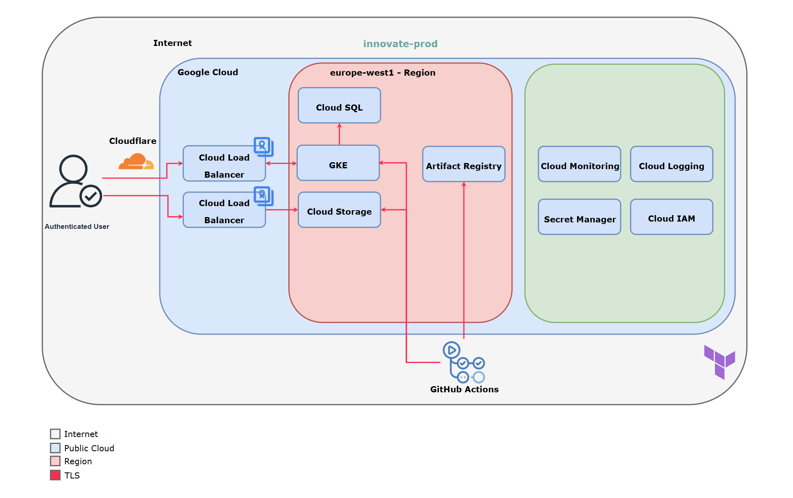

# Innovate Inc. — GCP Architecture (Minimal & Scalable — GKE Autopilot with Cloud Run Advantage)

**Date:** 2025‑11‑08  
**Stack:** React SPA • Flask/REST API • PostgreSQL

---

## 🎯 Goal
Deliver a **robust, secure, and cost‑effective** architecture that supports Innovate Inc.’s early‑stage development while being fully capable of scaling to millions of users.  
While **GKE Autopilot** provides the foundation for flexibility and control, **Cloud Run** is positioned as a superior long‑term path for operational simplicity and elasticity.

---

## 0) Assumptions
- Primary users in EU/US; no strict data‑residency requirement yet.  Example:
  - **EU (default):** `europe‑west1` (Belgium)  
  - **US (alternative):** `us‑central1` (Iowa)
- SLA target **99.5–99.9%**; downtime initially “inconvenient,” not revenue‑critical.  
- Certificates: **Google‑managed** (auto‑renew, no cost).  
- Stateless API; background work via K8s **Jobs/CronJobs**.  
- CI/CD = **GitHub Actions (OIDC)**; IaC = **Terraform**.  
- PII stored securely; room for WAF/CMEK/VPC‑SC enhancements later.

---

## 1) Cloud Environment Structure

| Environment | Purpose | Notes |
|--------------|----------|-------|
| **innovate‑dev** | Development & test | smaller DB, low limits |
| **innovate‑prod** | Production | baseline + scale options |

🟢 **Minimal now:** two projects.  
🟡 **Upgrade path:** add `innovate‑platform` later to host a Shared VPC, DNS, KMS, and central logs.

<details>
<summary>🧩 Advanced: Security & Governance</summary>

- **IAM separation:** Human vs. workload identities.  
  - Humans via **Cloud IAM + MFA**, group-based roles (no owners).  
  - Workloads via **Workload Identity** (GKE) or Cloud Run service identities (least privilege).  
- **Budgets & alerts:** 80/90/100% thresholds per project; labels (`env`, `service`, `owner`) for cost tracking.  
- **Commitments:** Add **CUDs** (Cloud Run) or **Compute CUDs** (Autopilot) when usage stabilizes.  
</details>

---

## 2) Network Design

### 2.1 Baseline
- **VPC (regional)** in `europe‑west1`; single subnet (`subnet‑app`, /22).  
- **Private Service Access** for Cloud SQL (no public IP).  
- **Default‑deny firewalls**; allow only:
  - LB health checks → GKE pods  
  - GKE pods → Cloud SQL (Private IP)  
- Routing and NAT handled automatically by GCP (Autopilot).

### 2.2 Edge Layer
- **Frontend (SPA):** Cloud Storage + **Cloud CDN** behind a global HTTPS LB.  
- **Backend (API):** GKE Autopilot or **Cloud Run** service behind HTTPS LB.  
- **TLS:** Google‑managed certs; HTTPS‑only; Cloudflare (DNS‑only).  

```
User → Cloudflare DNS →
  ├─ app.innovate.com → LB + CDN → Cloud Storage (SPA)
  └─ api.innovate.com → LB → GKE (or Cloud Run) → Cloud SQL (Private IP)
```

🟢 **Minimal now:** separate HTTPS LBs (simple, managed).  
🟡 **Upgrade path:** unified LB (backend bucket + NEG) or Cloud Armor WAF.

<details>
<summary>🧩 Advanced: Trust Boundaries & Connectivity</summary>

- **TLS everywhere:** Browser→CF→LB, LB→GKE/Cloud Storage, GKE→Cloud SQL all encrypted.  
- **Private IP & PSA:** Cloud SQL accessible only via **Private Service Access**; no public endpoints.  
- **Cloudflare DNS‑only:** “Gray cloud” (no proxy); TLS terminates at Google LB. Switch to “orange cloud” later for WAF/edge cache.  
- **Health checks:** HTTPS/443 for LB backend services; GKE Ingress uses NEGs, SPA uses backend buckets.  
</details>

### 2.3 Admin & Access
- **Public control plane** with **Authorized Networks** (IP‑restricted).  
- IAM‑based `gcloud get‑credentials` access; no static kubeconfigs.  
- 🟡 **Upgrade:** Private control plane when VPN or secure admin path exists.

---

## 3) Compute Platform — GKE Autopilot with Cloud Run Option

### 3.1 GKE Autopilot (Baseline)
- **1× regional Autopilot cluster** per project (`innovate‑dev`, `innovate‑prod`).  
- Namespaces: `infra`, `app`, `web`, `jobs`.  
- GKE Autopilot removes node management while retaining Kubernetes flexibility.

**Benefits:** predictable scaling, mature K8s ecosystem, flexible CI/CD, and seamless migration path to multi‑region setups.  
**Challenges:** Kubernetes expertise required, ongoing ops tuning, and baseline cost even when idle.

### 3.2 Scaling & Resources
- **HPA** (CPU/latency) + defined requests/limits.  
- **PDBs** for high availability; Autopilot handles cluster scaling.  
- 🟡 **Upgrade:** VPA for jobs, LimitRanges, ResourceQuotas.

### 3.3 Security & Identity
- **Workload Identity** (GSA↔KSA).  
- **Secrets Store CSI** + **Secret Manager** (no plaintext secrets).  
- Pods run non‑root, read‑only FS.  
- 🟡 **Upgrade:** Binary Authorization, NetworkPolicies.

### 3.4 Containerization
- **Backend:** Flask API in multi‑stage Dockerfile with health endpoints.  
- **Frontend:** React built to static assets → Cloud Storage + CDN.  
- **Artifact Registry:** regional (`europe‑west1`).  
- **Security scans:** Artifact Registry, Trivy.  

### 3.5 CI/CD Pipeline
1. PR approvals + lint/test.  
2. GitHub Actions → OIDC → short‑lived GCP token (no static key).  
3. Build → Scan → Push → Deploy to GKE via `kubectl`.  
4. SPA deploy via `gsutil rsync` to Cloud Storage + CDN invalidate.  
5. Post‑deploy health checks, rollback, Slack notify.  

🟢 **Minimal now:** GitHub Actions → GKE direct deploy.  
🟡 **Upgrade path:** ArgoCD, Helm, Blue‑Green, Canary, multi‑env deploys.

<details>
<summary>🧩 Advanced: CI/CD & Operational Excellence</summary>

- **Image promotion:** Dev builds → tested → tag/digest promotion → prod (no rebuilds in prod).  
- **Security scans:** Run Trivy/Grype in pipeline; optionally sign images with `cosign`.  
- **Preview environments:** Temporary Cloud Run service or GKE namespace per PR.  
- **SLOs & Burn rate alerts:** p95 latency ≤ 300ms, 99.9% uptime target; alerts on 2h/24h windows.  
- **Incident response:** Defined runbooks; quarterly DR and restore drills.  
- **Policy gates**: block deploy if scans fail, if SLO burn-rate is high, or if migration scripts fail dry-run.
</details>

---

### 🟣 Alternative Path — Cloud Run (Better Now *and* Later)

Although GKE Autopilot is technically sound and production‑grade, **Cloud Run** provides a **simpler, faster, and equally scalable** alternative for Innovate Inc.’s use case.

#### Why Cloud Run Could Be the Better Choice

| Factor | GKE Autopilot | 🟣 Cloud Run |
|--------|----------------|--------------|
| **Management Overhead** | Kubernetes manifests, ingress, upgrades | None — fully managed service |
| **Scalability** | Cluster autoscaling | Global autoscaling, per‑request concurrency |
| **Cost Behavior** | Pay for provisioned pods (24/7) | Pay per request, scale to zero |
| **CI/CD Simplicity** | kubectl / Helm / Argo | Single `gcloud run deploy` or Terraform |
| **Security** | Pod isolation, IAM roles | Hardened sandbox + IAM per service |
| **Ops Maturity Needed** | Moderate (DevOps required) | Low — ideal for small team |
| **Latency under burst** | Good, pod warm‑ups required | Excellent — instant instance spin‑up |

#### 🧮 Simplified Comparison — Cost Dynamics in Europe‑West3

| Scenario | Description | Cloud Run (€/mo) | GKE Autopilot (€/mo) | Winner |
|-----------|--------------|------------------:|---------------------:|---------|
| **Small / early‑stage** | Few hundred users/day, bursty, low constant load | ~€40–€70 | ~€120–€200 | 🟣 **Cloud Run** |
| **Medium load** | Thousands of users/day, steady traffic | ~€150–€250 | ~€180–€260 | Depends on tuning |
| **High load** | Millions of users/day, consistent API calls | ~€300–€600 | ~€300–€550 | ⚖️ **Comparable** |

**Interpretation:**  
- For early and medium stages, **Cloud Run is 2–3× cheaper**, because it scales to zero and charges only for request time.  
- For high sustained traffic, costs converge — but Cloud Run retains operational simplicity and global elasticity advantages.


🟣 **Recommendation:** Keep GKE as a flexibility base but **move production API workloads to Cloud Run** once stable — for faster scaling, lower ops cost, and simpler deploys.

---

## 4) Database — Cloud SQL (PostgreSQL)

### 4.1 Baseline
- Managed **Cloud SQL for PostgreSQL** in `europe‑west1`.  
- **Single‑zone** (cost‑effective) with upgrade path to **Regional HA**.  
- **Private IP** only; no public access.  
- Secrets managed via **Secret Manager**.  
- Connection via **Cloud SQL Auth Proxy** or **pgBouncer**; enforce TLS (`sslmode=require`/`verify-full`).

### 4.2 Backups & DR
- Automated backups + PITR (7–14 days).  
- RPO ≤24h, RTO ≤24h (snapshot restore).  
- 🟡 **Upgrade:** Regional HA, read replicas, cross‑region replica, DNS failover.  
- Quarterly **restore drills** validate RTO/RPO metrics.

---

## 5) Cost Snapshot (tiny load)

| Region | GKE Autopilot | HTTPS LB | Cloud SQL (SZ) | Misc (Registry, Logs) | **Total** |
|--------|---------------:|-----------:|----------------:|----------------------:|-----------:|
| **europe‑west1** | €35–€75 | €18–€25 | €60–€90 | €5–€15 | **€120–€205/mo** |
| **us‑central1** | €32–€70 | €18–€25 | €55–€85 | €5–€15 | **€110–€195/mo** |

🟢 Dev env: ~€50–€110/mo.  
🟣 Cloud Run variant: typically **€60–€120/mo total** (depending on traffic pattern).

<details>
<summary>🧩 Advanced: Cost Optimization</summary>

- **Budgets & alerts** at 80/90/100%.  
- **CUDs:** Cloud Run spend-based or Compute CUDs for Autopilot.  
- **Cold start tradeoff:** Add min instances (Cloud Run) or node pool baseline (GKE) for latency vs cost.  
- **Lifecycle policies:** Archive logs after 30–90 days; compress artifacts after 60.  
</details>

---

## 6) Terraform Skeleton
```
infra/
├─ modules/
│  ├─ vpc
│  ├─ gke‑autopilot
│  ├─ cloudsql‑postgres
│  ├─ artifact‑registry
│  ├─ lb‑https‑dns
│  ├─ secrets (secret‑manager + csi)
│  ├─ monitoring‑alerts
│  └─ cloud‑run (🟣 optional)
└─ envs/
   ├─ dev/
   │  ├─ main.tf
   │  ├─ variables.tf
   │  └─ outputs.tf
   └─ prod/
      ├─ main.tf
      ├─ variables.tf
      └─ outputs.tf
```

---

✅ **Summary — Minimal Now / Upgrade / Alternative Later**

| **Layer** | **Minimal Now** | **Upgrade Path 🟡** | **Alternative Path 🟣 (Cloud Run)** |
|------------|-----------------|--------------------|-------------------------------------|
| **Accounts / Projects** | 2 (dev, prod) | + Shared Platform | — |
| **Networking** | Simple regional VPCs | Shared VPC, WAF | Same VPC via connector |
| **Compute** | GKE Autopilot | Multi‑region, GitOps | Serverless, zero‑ops |
| **Data** | Cloud SQL (single‑zone) | HA / replicas / DR region | Same DB via connector |
| **Edge** | 2 LBs (SPA / API) | Unified LB, CDN, Cloud Armor | Built‑in HTTPS endpoint |
| **Secrets** | Secret Manager (GMEK) | CMEK, centralized mgmt | Same secrets / IAM model |
| **CI / CD** | GH Actions (OIDC) | ArgoCD, Helm, Canary | `gcloud run deploy` |
| **Security** | TLS, IAM, CSI | BinaryAuth, Policies, VPC‑SC | Cloud Run sandbox + IAM |

---

## 7) Architecture - HDL



---
🟣 **Final Note:**  
Even though Innovate Inc. initially targets Kubernetes (GKE Autopilot), **Cloud Run provides the same scalability with less operational complexity and cost**.  
For a startup without a dedicated platform team, it’s the pragmatic evolution: *keep flexibility with GKE, but scale efficiently with Cloud Run once growth demands simplicity and global elasticity*.